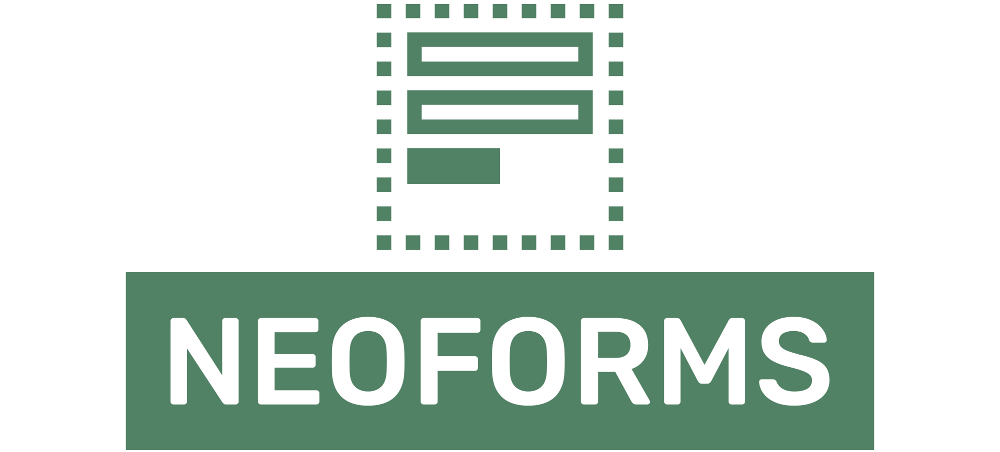

NeoForms is a better way to write and render forms in Nette Framework. It gives you conventions (so that everyone writes forms the same way), 
takes great patterns from Symfony Forms (to give you better way to write complex HTML markup), 
allows you to style components through a .latte template file and also gives you a read-only mode.

# Installation

```shell
composer require efabrica/neo-forms
```

```neon
# config.neon
includes:
    - ../../vendor/efabrica/neo-forms/config.neon
```

# Documentation

<!-- TOC -->
  * [Using ActiveRowForm](#using-activerowform)
      * [Presenter](#presenter)
      * [Using component in latte (simple rendering)](#using-component-in-latte--simple-rendering-)
      * [Using component in latte (custom HTML structure around it)](#using-component-in-latte--custom-html-structure-around-it-)
      * [Using component in latte (stand-alone HTML template for form)](#using-component-in-latte--stand-alone-html-template-for-form-)
  * [{formGroup} example](#formgroup-example)
  * [.row .col grid layout in PHP](#row-col-grid-layout-in-php)
  * [Latte Tags (API)](#latte-tags--api-)
    * [`{neoForm}`](#neoform)
    * [`{formRow}`](#formrow)
    * [`{formGroup}`](#formgroup)
    * [`{formRowGroup}`](#formrowgroup)
    * [`{formLabel}`](#formlabel)
    * [`{formInput}`](#forminput)
    * [`{formSection}`](#formsection)
  * [Control Options](#control-options)
    * [`"icon"`](#icon)
    * [`"description"`](#description)
    * [`"info"`](#info)
    * [`"readonly"`](#readonly)
    * [`"class"`](#class)
    * [`"input"`](#input)
<!-- TOC -->

## Using ActiveRowForm

```php
use Efabrica\NeoForms\Build\NeoForm;
use Efabrica\NeoForms\Build\NeoFormFactory;
use Efabrica\NeoForms\Build\NeoFormControl;
use Efabrica\NeoForms\Build\ActiveRowForm;
use Nette\Database\Table\ActiveRow;
use Nette\Application\UI\Template;

class CategoryForm extends ActiveRowForm
{
    private NeoFormFactory $formFactory;
    private CategoryRepository $repository;

    /** No parent constructor */
    public function __construct(NeoFormFactory $formFactory, CategoryRepository $repository) {
        $this->formFactory = $formFactory;
        $this->repository = $repository;
    }

    /**
     * This method is yours, it is not overridden, but needs to be implemented. 
     * You can have any arguments that you wish. They do not have to be nullable.
     * $row argument is optional.
     */
    public function create(?ActiveRow $row = null): NeoFormControl
    {
        $form = $this->formFactory->create();
        
        $form->addText('name', 'dictionary.app.adminmodule.form.categoryform.name')
            ->setHtmlAttribute('placeholder', 'dictionary.app.adminmodule.form.categoryform.enter_category_name')
            ->setRequired('dictionary.app.adminmodule.form.categoryform.name_is_required_to_fill')
        ;
        $form->addText('description', 'dictionary.app.adminmodule.form.categoryform.description')
            ->setHtmlAttribute('placeholder', 'dictionary.app.adminmodule.form.categoryform.type_category_description')
            ->setRequired('dictionary.app.adminmodule.form.categoryform.description_is_required_to_fill')
        ;
        // You can use $this->translate(...) if needed, but most of the things are already translated in render
        $form->addSubmit('save', 'dictionary.app.adminmodule.form.categoryform.default.' . ($row === null ? 'edit' : 'create'));
        
        return $this->control($form, $row);
    }

    protected function initFormData(ActiveRow $row): array
    {
        return ['name' => $row->name, 'description' => $row->description];
    }

    // optional, called before onCreate and onUpdate
    protected function onSuccess(NeoForm $form, array $values, ?ActiveRow $row): void
    {
        $category = $this->repository->insertOrUpdate($row, $values);
        $form->finish('Category ' . $category->name . ' saved.');
    }

    // optional, called if $row is null
    protected function onCreate(NeoForm $form, array $values): void
    {
        $category = $this->repository->insert($values);
        $form->finish('Category ' . $category->name . ' created.', 'detail', $row->id);
    }

    // optional, called if $row is not null
    protected function onUpdate(NeoForm $form, array $values, ActiveRow $row): void
    {
        $this->repository->update($row, $values);
        $form->finish('Category updated.', 'detail', $row->id);
    }

    // can be empty and not implemented
    protected function template(Template $template): void
    {
        $template->setFile(__DIR__ . '/templates/default.latte'); // only if you want custom layout
        $template->metaKeys = $this->metaKeys ??= $this->metaKeyRepository->findAll()->order('sorting ASC');
    }
}
```

#### Presenter

```php
class CategoryPresenter extends AdminPresenter 
{
    private CategoryForm $form;
    private CategoryRepository $repository;

    public function actionCreate(): void
    {
        $this->addComponent($this->form->create(), 'categoryForm');
    }
    
    public function actionUpdate(int $id): void
    {
        $row = $this->repository->findOneById($id);
        if (!$row instanceof \Nette\Database\Table\ActiveRow) {
            throw new \Nette\Application\BadRequestException();
        }
        $this->addComponent($this->form->create($row), 'categoryForm');
    }
}
```

#### Using component in latte (simple rendering)

```latte
{* create.latte *}
{block content}
{* You can wrap it in your internal business template: *}
<div class="c-card">
    <div class="body-wrapper">
        <div class="body">
            {control categoryForm}
        </div>
    </div>
</div>
```

#### Using component in latte (custom HTML structure around it)

```latte
{* create.latte *}
{block content}
{* You can wrap it in your internal business template: *}
<div class="c-card">
    <div class="body">
        {neoForm categoryForm}
        {formRow $form['title'], data-joke => 123}
        {formRow $form['bodytext']}
        {formRow $form['published_at'], input => [class => 'reverse']}
        {formRow $form['time_identifier']}
        <div class="row">
            <div class="col-5">{formRow $form['is_pinned']}</div>
            <div class="col-4">{formRow $form['is_highlight']}</div>
            <div class="col-3">{formRow $form['is_published']}</div>
        </div>
        {formRow $form['tags']}
        {* save button and every other unrendered input gets automatically
        rendered on the end of form, because it wasn't rendered yet *}
        {/neoForm}
    </div>
</div>
```

#### Using component in latte (stand-alone HTML template for form)

```latte
{* categoryForm.latte *}
{neoForm categoryForm}
    {formRow $form['title'], data-joke => 123}
    {formRow $form['bodytext']}
    {formRow $form['published_at'], input => [class => 'reverse']}
    {formRow $form['time_identifier']}
    <div class="row">
        <div class="col-5">{formRow $form['is_pinned']}</div>
        <div class="col-4">{formRow $form['is_highlight']}</div>
        <div class="col-3">{formRow $form['is_published']}</div>
    </div>
    {formRow $form['tags']}
    {* save button and every other unrendered input gets automatically
    rendered on the end of form, because it wasn't rendered yet *}
{/neoForm}
```

```php
class CategoryForm extends \Efabrica\NeoForms\Build\ActiveRowForm {
    // ... 
    protected function template(\Nette\Application\UI\Template $template) : void{
        $template->setFile(__DIR__.'/templates/categoryForm.latte');
        $template->someVariable = new SomeValue();
    }
}
```

```latte
{* create.latte remains the same: *}
{block content}
<div class="c-card">
    <div class="body">
        {control categoryForm}
    </div>
</div>
```

## {formGroup} example

```php
/** @var \Efabrica\NeoForms\Build\NeoForm $form */
$names = $form->group('names');
$names->addText('id', 'ID');
$names->addText('icon', 'Icon');

$checkboxes = $form->group('checkboxes');
$checkboxes->addToggleSwitch('enabled', 'Enabled');
$checkboxes->addCheckbox('verified', 'Verified');
```

```latte
{neoForm categoryForm}
<div class="row">
    <div class="col-6">
        {formGroup $form->getGroup('names')} {* renders id & icon*}
    </div>
    <div class="col-6">
        {formGroup $form->getGroup('checkboxes')} {* renders enabled & verified *}
    </div>
</div>
{/neoForm}
```

## .row .col grid layout in PHP

```php
/** @var \Efabrica\NeoForms\Build\NeoForm $form */
$row1 = $form->row(); // returns row instnace
$col1 = $row1->col('6'); // returns new col instance, class="col-6"
$col1->addText('a');
$col1->addTextArea('b');
$col2 = $row1->col('6'); // returns new different col instance
$col2->addCheckbox('c');

$a = $form->row('main');
$b = $form->row('main');
assert($a === $b); // true, it's the same instance

```

`{control categoryForm}` then renders something like this:

```latte

<div class="row">
    <div class="col-6">
        {formRow $form['a']}
        {formRow $form['b']}
    </div>
    <div class="col-6">
        {formRow $form['c']}
    </div>
</div>
```

------

## Latte Tags (API)

### `{neoForm}`

Renders the `<form>` tag. Also renders all the unrendered inputs in the end of the form.

Argument is the name of the control without quotes.

To render an entire form without specifying any sub-elements write:

```html
{neoForm topicForm}{/neoForm}
<!-- same as {control topicForm} -->
```

If you do not wish to render certain form fields, use `rest => false` to not render rest of the form:

```html
{neoForm topicForm, rest => false}
{/neoForm}
<!-- similar to {form topicform}{/form} -->
```

This would render an empty `<form>`, similar to if you used the `{form}` tag.

---

### `{formRow}`

Renders `{formLabel}` and `{formInput}` inside a `{formRowGroup}`. Accepts options.

Argument is the `BaseControl` instance (ex. `$form['title']`)

The first argument can be any instance of `BaseControl`.

```html
{formRow $form['title'], class => 'mt-3'}

renders this:
<div class="group mt-3">...</div>
```

```html
{formRow $form['title'], input => [data-tooltip => 'HA!']}

renders this:
<div class="group">...<input ... data-tooltip="HA!"></div>
```

```html
{formRow $form['title'], label => [data-toggle => 'modal']}

renders this:
<div class="group">...<label for="..." data-toggle="modal">...</label></div>
```

If you want to change the layout of content inside the formRow, see `{formRowGroup}` below

---

### `{formGroup}`

Accepts `ControlGroup` as required argument.
Renders all controls in the group. Uses `{formRow}` internally.

```latte
{formGroup $form->getGroup('main')}
```

---

### `{formRowGroup}`

Simply said, renders `<div class='group'>`.

Use this tag to alter the inside of `div.group`. Example:

```html
{formRowGroup $form['title']}
{formLabel $form['title']}
{formErrors $form['title']}
<div class="recaptcha"></div> {* instead of input *}
{/formRowGroup}
```

---

### `{formLabel}`

Renders the `<label>`. Argument is `BaseControl` instance.

```html
{formLabel $form['title'], class => 'text-large', data-yes="no"}
=
<label ... class="c-form-element text-large" data-yes="no">{$caption}</label>
```

If the form element is hidden field or checkbox, the label is an empty HTML string.

---

### `{formInput}`

Renders the `<input>`, `<textarea>` `<button>` or whatever is the vital part of the form row.

Argument is `BaseControl` instance.

```html
{formInput $form['category'], data-select2 => true}
=
<input ... data-select2>
```

---

### `{formSection}`

Creates a `<fieldset>` with first argument being the caption that is optionally translated.

This is visual only, has no deeper functionality.

Argument is `string`.

```html
{if !empty($form->getGroup('Options')->getControls())}
{formSection "Options"}
{foreach $form->getGroup('Options')->getControls() as $option}
{formRow $option}
{/foreach}
{/formSection}
{/if}
```

------

## Control Options

You can set control options through `->setOption()` on `BaseControl` instances. This is the recommended approach.

For example:
`->addText('title', 'Title')->setOption('info', 'Shown on homepage')`

Or also through latte `{formRow}` parameters. This is the less tested approach.

Example: `{formRow $form['title'], info => "Shown on homepage"`

### `"icon"`

`string`. Works on buttons.
`->addSubmit(...)->setOption('icon', 'fa fa-home')` adds `<i class="fa fa-home"></i>` into the button, before the text.

You can modify the template and alter how the icon is added. In our company, we internally extend the template and use Google Material Icons instead.

```php
$form->addSubmit('save', 'Save')->setOption('icon', 'fa fa-save');
```

### `"description"`
`string`. Adds gray helper text under input. Works on every traditional input/row.
```php
$form->addPassword('password', 'Password')->setOption('description', 'At least 8 characters.');
```

### `"info"`
`string`. Adds a blue info circle tooltip next to the label. Works on every traditional input.
```php
$form->addText('title', 'Title')->setOption('info', 'This appears on homepage');
```

### `"readonly"`
`bool`. If set to true, value is not modifiable and will not be submitted. It is rendered as a badge instead.

```php
$form->addText('title', 'Title')->setOption('readonly', true);
```

```php
$form->addText('title', 'Title')->setOption('readonly', fn(TextInput $el) => strtoupper($el->getValue()));
```
### `"class"`
`string`. You can set class, or any other HTML attribute and it will be applied to the row/input/label.

```php
$form->addText('title', 'Title')->setOption('class', 'form-control-lg');
```

### `"input"`
`array`. You can apply this to the `{formRow}` tag to pass html attributes to input.

```latte
{formRow $form['title'], 'input' => ['class' => 'special']}
```

### `"label"`
`array`. You can apply this to the `{formRow}` tag to pass html attributes to input.

```latte
{formRow $form['title'], 'label' => ['class' => 'special']}
```