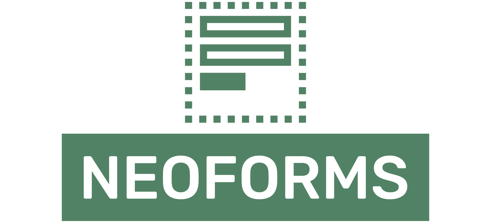

NeoForms are the very much needed medicine for Nette\Forms. 
- Gives you an easier way to write your own renderer templates
- Gives you conventions to collaborate with your team more efficiently
- Gives you a way to render form fields individually with the `{formRow}`, 
`{formLabel}` and `{formInput}` tags that you could be used to from Symfony.
- Gives you a way to render rows and columns when building the form in PHP
- Gives you a `readonly` mode to render a form for people who can't edit it by rendering regular text instead of inputs. (Say goodbye to grayed-out disabled fields!)
- Gives you FormCollection for pre-styled AJAX-less Multiplier with built-in diff calculator
- ControlGroup inside of a ControlGroup (tree structure)

# Installation

```shell
composer require efabrica/neoforms
```

```neon
# config.neon
includes:
    - ../../vendor/efabrica/neoforms/config.neon
```

# Documentation

<!-- TOC -->
  * [Using ActiveRowForm](#using-activerowform)
      * [Presenter](#presenter)
      * [Using component in latte (simple rendering)](#using-component-in-latte-simple-rendering)
      * [Using component in latte (custom HTML structure around it)](#using-component-in-latte-custom-html-structure-around-it)
      * [Using component in latte (stand-alone HTML template for form)](#using-component-in-latte-stand-alone-html-template-for-form)
  * [{formGroup} example](#formgroup-example)
  * [.row .col grid layout in PHP](#row-col-grid-layout-in-php)
  * [Latte Tags (API) Documentation](#latte-tags-api-documentation)
    * [`{neoForm}`](#neoform)
    * [`{formRow}`](#formrow)
    * [`{formGroup}`](#formgroup)
    * [`{formLabel}`](#formlabel)
    * [`{formInput}`](#forminput)
  * [Applying Attributes](#applying-attributes)
    * [`"icon"`](#icon)
    * [`"description"`](#description)
    * [`"info"`](#info)
    * [`"readonly"`](#readonly)
    * [`"class"`](#class)
    * [`"input"` and `"label"`](#input-and-label)
  * [Custom Template](#custom-template)
<!-- TOC -->

### Using ActiveRowForm

```php
use Efabrica\NeoForms\Build\NeoForm;
use Efabrica\NeoForms\Build\NeoFormFactory;
use Efabrica\NeoForms\Build\NeoFormControl;
use Efabrica\NeoForms\Build\ActiveRowForm;
use Nette\Database\Table\ActiveRow;
use Nette\Application\UI\Template;

class CategoryForm extends ActiveRowForm
{
    private NeoFormFactory $formFactory;
    private CategoryRepository $repository;

    // There is no parent constructor
    public function __construct(NeoFormFactory $formFactory, CategoryRepository $repository) {
        $this->formFactory = $formFactory;
        $this->repository = $repository;
    }

    /**
     * NeoFormControl is attached to presenter and used in template.
     * 
     * @param ActiveRow|null $row Optional ActiveRow parameter to fill the form with data
     * @return NeoFormControl
     */
    public function create(?ActiveRow $row = null): NeoFormControl
    {
        $form = $this->formFactory->create();
        
        $form->addText('name', 'Category Name')
            ->setHtmlAttribute('placeholder', 'Enter category name')
            ->setRequired('Name is required to fill');
        
        $form->addText('description', 'Category Description')
            ->setHtmlAttribute('placeholder', 'Type category description')
            ->setRequired('Description is required to fill');
        
        $form->addSubmit('save', ($row === null ? 'Edit' : 'Create') . ' Category')
            ->setIcon('save');
        
        return $this->control($form, $row);
    }
}
```

### Component Usage in Presenter

```php
class CategoryPresenter extends AdminPresenter 
{
    private CategoryForm $form;
    private CategoryRepository $repository;

    public function actionCreate(): void
    {
        $this->addComponent($this->form->create(), 'categoryForm');
    }
    
    public function actionUpdate(int $id): void
    {
        $row = $this->repository->findOneById($id);
        if (!$row instanceof \Nette\Database\Table\ActiveRow) {
            throw BadRequestException();
        }
        $this->addComponent($this->form->create($row), 'categoryForm');
    }
}
```

### Component Usage in Latte Templates

#### Simple Rendering

```latte
{* create.latte *}
{block content}
<div class="category-card">
    <div class="category-form-wrapper">
        {control categoryForm}
    </div>
</div>
```

#### Custom HTML Structure inside the `<form>` tag

```latte
{* create.latte *}
{block content}
<div class="category-card">
    <div class="category-form-wrapper">
        {neoForm categoryForm}
            {formRow $form['name'], data-joke => 123} {* adds [data-joke="123"] to the wrapping div *}
            {formRow $form['description']}
            
            <div class="row">
              <div class="col">{formRow $form['is_pinned']}</div>
              <div class="col">{formRow $form['is_highlight']}</div>
              <div class="col">{formRow $form['is_published']}</div>
            </div>
            {formRow $form['save'], input => [class => 'reverse']} {* sets input's class to 'reverse' *}
        {/neoForm}
    </div>
</div>
```

#### Stand-alone HTML Template for Form

```latte
{* categoryForm.latte *}
{neoForm categoryForm}
    {formRow $form['name'], data-joke => 123} {* adds [data-joke="123"] to the wrapping div *}
    {formRow $form['description']}
    {formRow $form['save'], input => [class => 'reverse']} {* sets input's class to 'reverse' *}
{/neoForm}
```

### Grouping Form Elements

```php
/** @var \Efabrica\NeoForms\Build\NeoForm $form */
$names = $form->group('names');
$names->addText('id', 'ID');
$names->addText('icon', 'Icon');

$checkboxes = $form->group('checkboxes');
$checkboxes->addToggleSwitch('enabled', 'Enabled');
$checkboxes->addCheckbox('verified', 'Verified');
```

```latte
{neoForm categoryForm}
<div class="row">
    <div class="col-6">
        {formGroup $form->getGroup('names')} {* renders id & icon *}
    </div>
    <div class="col-6">
        {formGroup $form->getGroup('checkboxes')} {* renders enabled & verified *}
    </div>
</div>
{/neoForm}
```

### .row .col Grid Layout in PHP

```php
/** @var \Efabrica\NeoForms\Build\NeoForm $form */
$row1 = $form->row(); // returns a row instance
$col1 = $row1->col('6'); // returns a new col instance, class="col-6"
$col1->addText('a');
$col1->addTextArea('b');
$col2 = $row1->col('6'); // returns a new different col instance
$col2->addCheckbox('c');

$a = $form->row('main');
$b = $form->row('main');
assert($a !== $b); // true - row('main') builds a new ControlGroupBuilder every call
assert($form->getGroup('main') === $form->getGroup('main')); // true - but the underlying ControlGroup is reused
```

Use `end()` to climb back up to the parent builder after `col()`/`row()`/`group()`, Doctrine-`QueryBuilder`-style - useful when nesting groups without keeping every intermediate variable around. Note that `end()` only chains after `col()`/`row()`/`group()`/`setLabel()`/`setClass()`/`setOption()`, never directly after an `addX()` call, since `addText()` and friends return the underlying Nette control, not the builder:

```php
$form->row()
    ->group('left')->addText('a')->end() // wrong! addText() returns a TextInput, not the builder

// instead, keep a reference to the builder to add multiple fields, or call end() on it separately:
$row = $form->row();
$left = $row->col('6');
$left->addText('a');
$left->addTextArea('b');
$right = $left->end()->col('6'); // end() climbs back to $row, then col('6') creates a sibling
$right->addCheckbox('c');
```

------

## Latte Tags (API) Documentation

### `{neoForm}`

The `{neoForm}` tag is used to render the `<form>` element in your HTML. It can also render all the unrendered inputs at the end of the
form. The argument for this tag is the name of the control without quotes.

> To render an entire form without specifying any sub-elements, use the following syntax:
>
>```html
>{neoForm topicForm}{/neoForm}
><!-- This is equivalent to {control topicForm} -->
>```

> If you want to exclude certain form fields from rendering, you can use `rest => false` like this:
>
>```html
>{neoForm topicForm, rest => false}
>{/neoForm}
><!-- This is similar to {form topicform}{/form} -->
>```
>
>This will render an empty `<form>`, similar to using an empty `{form}` tag.

---

### `{formRow}`

The `{formRow}` tag is used to render a form label and form input inside a wrapping group. It accepts various options. The argument for this
tag is a `BaseControl` instance (e.g., `$form['title']`).

Here are some examples of how to use `{formRow}`:

> ```latte
>{formRow $form['title'], class => 'mt-3'}
>```
>
>This renders a form row with a custom class, resulting in `<div class="mt-3">...</div>`.

> ```latte
>{formRow $form['title'], '+class' => 'mt-3'}
>```
>
>If you are using a Bootstrap template, this will render a form group with a class, resulting in `<div class="form-group mt-3">...</div>`.
>

You can also add attributes to the input or label elements using options:

> ```html
>{formRow $form['title'], input => [data-tooltip => 'HA!']}
>```
>
>This renders a form row with an input element that has a `data-tooltip` attribute.

> ```html
>{formRow $form['title'], label => [data-toggle => 'modal']}
>```
>
>This renders a form row with a label element that has a `data-toggle` attribute.

---

### `{formGroup}`

The `{formGroup}` tag accepts a `ControlGroup` as a required argument and renders all controls in the group. It internally uses `{formRow}`
to handle rendering.

Example usage:

```latte
{formGroup $form->getGroup('main')}
```

---

### `{formLabel}`

The `{formLabel}` tag is used to render a `<label>` element. The argument is a `BaseControl` instance.

Example usage:

> ```html
>{formLabel $form['title'], class => 'text-large', data-yes="no"}
>```
>
>This renders a label element with a custom class and data attributes.
>
If the form element is a hidden field or checkbox, the label is rendered as an empty HTML string.

---

### `{formInput}`

The `{formInput}` tag is used to render an `<input>`, `<textarea>`, `<button>`, or any other essential part of a form row. The argument is
a `BaseControl` instance.

Example usage:

> ```html
>{formInput $form['category'], data-select2 => true}
>```
>
>This renders an input element with an empty `data-select2` attribute.

---

## Applying Attributes

Attributes can be applied to form elements using options. Here are some commonly used attributes:

### `"icon"`

The `"icon"` attribute, when applied to buttons, adds an icon before the text. For example:

```php
$form->addSubmit('save', 'Save')->setOption('icon', 'fa fa-save');
```

You can customize how the icon is added in your template.

### `"description"`

The `"description"` attribute adds gray helper text under input elements. For example:

```php
$form->addPassword('password', 'Password')->setOption('description', 'At least 8 characters.');
```

### `"info"`

The `"info"` attribute adds a blue info circle tooltip next to the label. For example:

```php
$form->addText('title', 'Title')->setOption('info', 'This appears on homepage');
```

### `"readonly"`

The `"readonly"` attribute, when set to true, makes the value non-modifiable and not submitted. It is rendered as a badge. Examples:

```php
$form->addText('title', 'Title')->setOption('readonly', true);
// or
{formRow $form['title'], readonly => true}
// or
$form->setReadonly(true); // to make the entire form readonly
// or
{neoForm yourForm, readonly => true} // to make the entire form readonly
```

You can also provide a callback function for dynamic readonly behavior.

### `"class"`

The `"class"` attribute allows you to override a class or any other HTML attribute to the row/input/label. For example:

```php
$form->addText('title', 'Title')->setOption('class', 'form-control form-control-lg');
```

> If you want to keep the classes from your template, use `+class` instead:
>
>```php
>$form->addText('title', 'Title')->setOption('+class', 'form-control-lg');
>```
>
>This also works:
>
>```latte
>{formRow $form['title'], input => ['+class' => 'form-control-lg']}`
>```

> If you want to force remove a class from your template, use false instead:
>
>```php
>$form->addText('title', 'Title')->setOption('class', false);
>```

### `"input"` and `"label"`

You can apply these attributes to the `{formRow}` tag to pass HTML attributes to the input and label elements, respectively. Example:

```latte
{formRow $form['title'], 'input' => ['class' => 'special']}
{formRow $form['title'], 'label' => ['class' => 'special']}
```

---

## FormCollection

### Usage:
```php
use Efabrica\NeoForms\Build\NeoContainer;
// Create a new collection called "sources"
$form->addCollection('sources', 'Sources', function (NeoContainer $container) {
    // Add some fields to the collection
    $container->addText('bookTitle', 'Book Title');
    $container->addInteger('Year', 'Year');
    // Add another collection for authors
    $container->addCollection('authors', 'Authors', function (NeoContainer $container) {
        $container->addText('author', 'Author');
    });
});
```

You render the form as any other control in the form. (`{formRow}` or automatically)

Processing
```php
protected function onUpdate(NeoForm $form, array $values, ActiveRow $row): void
{
    // To process the form, you can get the new state of the collection like this:
    $sources = $values['sources'];
    
    // If you want to use the Diff API, you can do something like this:
    $diff = $form['sources']->getDiff();
    foreach($diff->getAdded() as $newRow) {
        $this->sourceRepository->insert($newRow);
    }
    foreach($diff->getDeleted() as $removedRow) {
        $this->sourceRepository->delete($removedRow);
    }
    foreach($diff->getModified() as $updatedRow) {
        $row = $this->sourceRepository->findOneBy($updatedRow->getOldRow());
        $row->update($updatedRow->getDiff());
    }
}
```

You don't have to use the Diff API. If you for example only use a simple collection of single text inputs, 
you might find it easier to just persist the new array of values.

### Lifecycle hooks

`FormCollection::$onAddItem` and `$onRemoveItem` fire whenever an item is attached to or detached from the
collection's component tree - useful for wiring extra validators/logging on dynamically-created items from
outside the original factory closure:

```php
$collection = $form->addCollection('sources', 'Sources', function (NeoContainer $container) {
    $container->addText('bookTitle', 'Book Title');
});
$collection->onAddItem[] = function (FormCollectionItem $item): void {
    $item->addText('note', 'Internal Note'); // e.g. add an admin-only field to every row
};
```

> `onAddItem` fires any time a component is attached to the tree - including on the very first
> `setValues()`/hydration of existing rows loaded from the database, not just when a user clicks "add" in
> the browser. If you want to know whether the user actually added a new row, keep using `getDiff()->getAdded()`
> from the Diff API above; these hooks are for lower-level cross-cutting concerns instead.

---

## Rendering Outside of Latte

`NeoFormRenderer::form()` returns a `Generator` on purpose - it's what lets the `{neoForm}...{/neoForm}` tag inject
your block body mid-render. If you need to render a `NeoForm` somewhere without Latte (a console command, a PDF
export, an API endpoint), use `renderToHtml()` instead of dealing with the generator yourself:

```php
/** @var \Efabrica\NeoForms\Render\NeoFormRenderer $renderer */
/** @var \Efabrica\NeoForms\Build\NeoForm $form */
$html = $renderer->renderToHtml($form);
echo $html; // a plain Nette\Utils\Html instance, fully rendered
```

This is also what `NeoFormNetteRenderer` (the `Nette\Application\UI\Form` bridge, used by `{control someForm}`) uses
internally to render a form as a single string.

---

## Custom Template

To create your own extended template for rendering forms, you can follow our examples. Below is a step-by-step guide on how to create your
custom extended template using Bootstrap 4 as an example:

**Step 1: Create a New PHP Class**

Create a new PHP class for your extended template by extending the base template class. In this example, we'll call
it `Bootstrap5FormTemplate`. Make sure to place this class in an appropriate namespace, just like in the provided code.

```php
namespace Your\Namespace\Here;

use Efabrica\NeoForms\Render\Template\NeoFormTemplate;
// ... Import other necessary classes here ...

class Bootstrap4FormTemplate extends NeoFormTemplate
{
    // Your template implementation goes here
}
```

**Step 2: Customize Form Elements**

Override the methods in your extended template class to customize the rendering of form elements according to your preferred Bootstrap 4
styling. For example, you can define how text inputs, buttons, checkboxes, and other form elements should be rendered with Bootstrap
classes.

Here's an example of customizing the rendering of text inputs:

```php
protected function textInput(TextInput $control, array $attrs): Html
{
    $el = $control->getControl();
    $el->class ??= 'form-control'; // Add Bootstrap class, if no class was specified through ->setHtmlAttribute()
    return $this->applyAttrs($el, $attrs);
}
```

**Step 3: Customize Form Labels**

You can also customize how form labels are rendered. In Bootstrap, you may want to add the `col-form-label` class for proper alignment.
Override the `formLabel` method to achieve this:

```php
public function formLabel(BaseControl $control, array $attrs): Html
{
    $el = $control->getLabel();
    $el->class ??= 'col-form-label'; // Add Bootstrap class
    $el->class('required', $control->isRequired())->class('text-danger', $errors !== []);
    $this->addInfo($control, $el);

    foreach ($errors as $error) {
        $el->addHtml(
            Html::el('span')->class('c-button -icon -error -tooltip js-form-tooltip-error')
                ->setAttribute('data-bs-toggle', 'tooltip')
                ->title($control->translate($error))
                ->addHtml(Html::el('i', 'warning')->class('material-icons-round'))
        );
    }
    // Customize label rendering as needed
    return $this->applyAttrs($el, $attrs);
}
```

**Step 4: Customize Buttons**

For buttons, you can add Bootstrap classes and icons if desired. Customize the rendering of buttons like this:

```php
protected function button(Button $control, array $attrs): Html
{
    $el = $control->getControl();
    $el->class ??= 'btn btn-primary'; // Add Bootstrap 4 classes
    $icon = $control->getOption('icon');
    if (is_string($icon) && trim($icon) !== '') {
        $el->insert(0, Html::el('i')->class("fa fa-$icon")); // Add an icon if available
    }
    // Customize button rendering as needed
    return $this->applyAttrs($el, $attrs);
}
```

**Step 5: Customize Other Form Elements**

Repeat similar customization for other form elements like checkboxes, radio buttons, select boxes, etc., based on your desired styling.

> **Checkbox caption gotcha:** `{formLabel}`/`NeoFormTemplate::formLabel()` is never even called for `Checkbox`
> controls - the renderer short-circuits to an empty `Html` for buttons, hidden fields and checkboxes, since a
> checkbox's caption traditionally sits next to the input, not above it. That means `checkbox()` is the *only*
> place the caption is rendered at all. Copying the `textInput()`-style override (`$control->getControl()`) to
> `checkbox()` silently drops the caption text, because `Checkbox::getLabel()` intentionally returns `null` and
> `getControl()` returns the caption nested *inside* the `<label>`. Use `getControlPart()`/`getLabelPart()` to
> get the input and caption as separate sibling elements instead:
>
> ```php
> protected function checkbox(Checkbox $control, array $attrs): Html
> {
>     $input = $control->getControlPart();
>     $input->class ??= 'form-check-input';
>     $label = $control->getLabelPart();
>     $label->class ??= 'form-check-label';
>     return Html::el('div')->class('form-check')
>         ->addHtml($this->applyAttrs($input, $attrs))
>         ->addHtml($label);
> }
> ```
>
> See `Bootstrap5FormTemplate::checkbox()` for the full, tested implementation of this pattern.

**Step 6: Implement Additional Styling**

If your template requires additional styling for specific elements or form groups, you can do so in your extended template class.

**Step 7: Apply Your Custom Template**
To use your custom template, you need to instantiate it and set it as the template for your forms when rendering. For example:

```php
use Your\Namespace\Here\BootstrapFormTemplate;
use Efabrica\NeoForms\Build\NeoForm;

// Instantiate your custom template
$template = new Bootstrap4FormTemplate();

// Create a NeoForm instance and set the custom template
$form = new NeoForm();
$form->setTemplate($template);

// Render your form
echo $form;
```

> If you want to use your custom template for all forms, you can set it as the default template by rewiring your auto-wiring :)
>
>```neon
># config.neon
>services:
>    neoForms.template: Your\Namespace\Here\Bootstrap4FormTemplate()
>```

By following these steps, you can create your own extended template for rendering forms in a way that aligns with Bootstrap 4 or any other
custom styling you prefer. Customize the template methods according to your specific styling needs.

### Shipped Templates

Two ready-to-use templates ship with the library, so you don't have to write one from scratch:

- `Efabrica\NeoForms\Render\Template\Bootstrap5FormTemplate` - `form-control`/`form-select` inputs, `is-invalid`/`invalid-feedback`
  validation styling, `mb-3` row spacing, `btn btn-primary` buttons and Bootstrap `form-check` checkboxes.
- `Efabrica\NeoForms\Render\Template\TailwindFormTemplate` - a deliberately minimal starting point (Tailwind has no component
  classes to target the way Bootstrap does), exposing overridable `protected string $...Class` properties (e.g. `$inputClass`,
  `$buttonClass`) instead of a finished design system.

Wire either one up exactly like a custom template (Step 7 above), e.g.:

```neon
# config.neon
services:
    neoForms.template: Efabrica\NeoForms\Render\Template\Bootstrap5FormTemplate()
```

Both are subclasses of `NeoFormTemplate`, so you can still extend either one further if you need small tweaks.

### Custom Control Renderers

If you only need to customize the rendering of a single custom control (rather than restructure the whole template),
`NeoFormTemplate::setControlRenderer()` is a lighter-weight alternative to subclassing:

```php
$template = new NeoFormTemplate();
$template->setControlRenderer(App\Forms\ColorPicker::class, function (App\Forms\ColorPicker $control, array $attrs) {
    return Html::el('input')->type('color')->name($control->getHtmlName())->value($control->getValue());
});
```

Or wire it via DI:

```neon
# config.neon
services:
    -
        type: Efabrica\NeoForms\Render\Template\NeoFormTemplate
        setup:
            - setControlRenderer(App\Forms\ColorPicker::class, [App\Forms\ColorPickerRenderer(), render])
```

Registered renderers are consulted before the built-in `instanceof` chain, so they take priority over the default rendering
for that control class - but reserve full subclassing (as shown above) for wholesale HTML restructuring across many control types.
